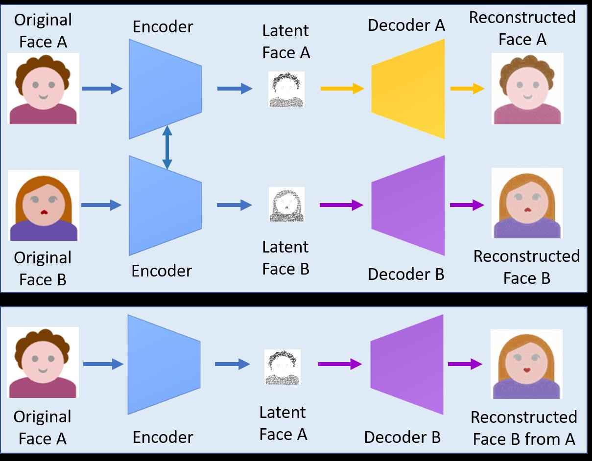
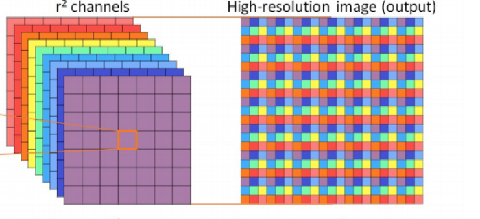

# deepfakes
I will arrange all of the notes properly once I get a better idea of how it works. 

## Important links
1. [Deepfake paper](https://arxiv.org/abs/1909.11573)
2. [Real-Time Single Image and Video Super-Resolution Using an Efficient
Sub-Pixel Convolutional Neural Network i.e pixel shuffling paper](https://arxiv.org/pdf/1609.05158v2.pdf)
3. [Useful article in super-resolution](https://towardsdatascience.com/an-evolution-in-single-image-super-resolution-using-deep-learning-66f0adfb2d6b)

---
## Notes from the deepfake paper 

### The original method

This required three main parts:
1. An encoder that encodes an image into a lower dimensional vector.
2. A decoder that reproduces face A from the encoded vector
3. Another decoder that reproduces face B from the encoded vector. 

This image from the original paper summarises it better than anything else:

---
## Notes from the pixel shuffling paper

### Intro
Generally, super-resolution operation is done on the high resolution space, but in this paper, they proposed a new way to do it in the low resolution space, which in turn would require less computational power. 

### More about SR operations
The SR operation is effectively a **one-to-many mapping from LR to HR space** which can have multiple solutions. A key assumption that underlies many SR techniques is that much of the high-frequency data is redundant and thus can be accurately reconstructed from low frequency components.

> Important full form: **PSNR** = **P**eak **S**ignal to **N**oise **R**atio. Higher means good quality and low means bad quality w.r.t the original image. It is measured in decibels (dB). Here's the [wikipedia page](https://en.wikipedia.org/wiki/Peak_signal-to-noise_ratio)

### Drawbacks of older approaches
* **Increasing the resolution** of the LR images before the image
enhancement step **increases the computational complexity**.
* **Interpolation methods** such as bicubic interpolation **do not bring additional information** to solve the problem. 

### What's new in their approach ?
Contrary to previous works, they increase the resolution from LR to HR only at the very end of the network and super-resolve HR data from LR feature maps. It's advantages are;
1. Requires lower computational power.
2. Not using an explicit interpolation filter means that the network implicitly learns the processing necessary for SR.

### Transpose convolutions v/s sub-pixel convolutions

In transpose convolutions, upsampling with strides adss zero values to upscale the image which are to be filled later on. Maybe even worse, these zero values have no gradient information that can be backpropagated through.

While sub-pixel convolutional layers essentially uses regular convolutional layers followed by a specific type of image reshaping called a **phase shift**. Instead of putting zeros in between pixels and having to do extra computation, they calculate more convolutions in lower resolution and resize the resulting map into an upscaled image. This way, no meaningless zeros are necessary. 

> Some parts written above are quoted from [this repository](https://github.com/atriumlts/subpixel)

**Phase shift** is also called “pixel shuffle”, which is a tensor of size `H × W × C · r² ` to size `rH × rW × C` tensor as shown below. An implementation of this operation can be found [here](https://github.com/Mayukhdeb/deepfakes/blob/8df7f7ace220b76f4f9564ddf444593d36a85f4f/deepfake_utils/autoencoder_utils.py#L52). 

